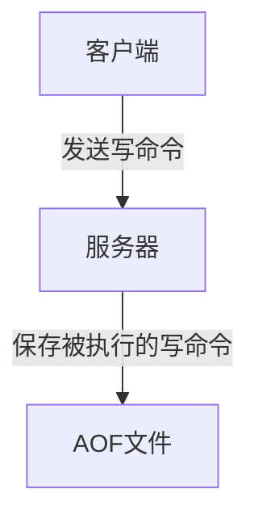

[Redis官方文档](https://redis.io/topics/persistence#rdb-advantages)
### 一、Redis服务器中的数据库

Redis服务器中也有数据库这么一个概念。如果不指定具体的数量，默认会有16个数据库。
```c
select 15
```
>这说明，数据库与数据库之间的数据是隔离的。
#### 1.1 Redis数据库的原理
Redis服务器用redisServer结构体来表示，其中redisDb是一个数组，用来保存所有的数据库，dbnum代表数据库的数量(这个可以配置，默认是16)

```java
struct redisServer{  

    //redisDb数组,表示服务器中所有的数据库
    redisDb *db;  

    //服务器中数据库的数量
    int dbnum;  

}; 
```

Redis客户端通过redisClient结构体来表示：
```java
typedef struct redisClient{  

    //客户端当前所选数据库
    redisDb *db;  

}redisClient;
```


Redis中对每个数据库用redisDb结构体来表示:
```java
typedef struct redisDb { 
    int id;         // 数据库ID标识
    dict *dict;     // 键空间，存放着所有的键值对              
    dict *expires;  // 过期哈希表，保存着键的过期时间                          
    dict *watched_keys; // 被watch命令监控的key和相应client    
    long long avg_ttl;  // 数据库内所有键的平均TTL（生存时间）     
} redisDb;
```
其中`dict *dict`为键空间，存放着所有的键值对。
键空间的示意图：


>Redis的数据库就是使用字典(哈希表)来作为底层实现的，对数据库的增删改查都是构建在字典(哈希表)的操作之上的。

比如：
```java
redis > GET message

"hello world"
```

 
 #### 1.2键的过期时间
 Redis是基于内存，但是内存是有限的。所以我们会干掉不常用的数据，保留常用的数据。这就需要我们设置一下键的过期(生存)时间了。
* 设置键的生存时间可以通过`EXPIRE`或者`PEXPIRE`命令。
* 设置键的过期时间可以通过`EXPIREAT`或者`PEXPIREAT`命令。
其实EXPIRE、PEXPIRE、EXPIREAT这三个命令都是通过PEXPIREAT命令来实现的。

redisDb结构体中有 `dict *expires;`属性，存放所有键过期的时间。
```c
redis > PEXPIREAT message 1391234400000
(integer) 1
//设置了message键的过期时间为1391234400000
```

* PERSIST(移除过期时间)

* TTL(Time To Live)返回剩余生存时间，以秒为单位

* PTTL以毫秒为单位返回键的剩余生存时间

#### 1.2.1过期策略

>key到了过期时间不一定会立刻删除

删除策略可分为三种
> * 定时删除(对内存友好，对CPU不友好)
> ** 到时间点上就把所有过期的键删除了。
> * 惰性删除(对CPU极度友好，对内存极度不友好)
> ** 每次从键空间取键的时候，判断一下该键是否过期了，如果过期了就删除。
> * 定期删除(折中)
> ** 每隔一段时间去删除过期键，限制删除的执行时长和频率。

Redis采用的是`惰性删除+定期删除`两种策略，所以说，在Redis里边如果过期键到了过期的时间了，未必被立马删除的！

#### 1.2.2内存淘汰机制
 前面的策略会出现，大量过期key堆积在内存内的情况，定期删除漏掉了很多过期key，也没及时去查(没走惰性删除)。
 >可以设置内存最大使用量，当内存使用量超出时，会施行数据淘汰策略。
 
 

| 策略 | 描述 |
| --- | --- |
| volatile_lru |从已经设置过期时间的数据集中挑选最近最少使用的数据进行淘汰|
| volatile_ttl | 从已经设置过期时间的数据集中挑选将要过期的进行淘汰 |
| volatile_random |  从已经设置过期时间的数据集中任意选择淘汰|
| allkeys_lru |  从所有数据集中挑选`最近最少使用`的数据进行淘汰|
|  allkeys_random| 从所有数据集中选择任意数据进行淘汰 |
| noeviction | 禁止删除数据 |

**设置热点数据**
>使用 Redis 缓存数据时，为了提高缓存命中率，需要保证缓存数据都是`热点数据`。可以将内存最大使用量设置为热点数据占用的内存量，然后启用allkeys-lru淘汰策略，将最近最少使用的数据淘汰


### 二、Redis持久化
Redis提供了两种不同的持久化方法来讲数据存储到硬盘里边：

* RDB(基于快照)，将某一时刻的所有数据保存到一个RDB文件中。

* AOF(append-only-file)，当Redis服务器执行写命令的时候，将执行的写命令保存到AOF文件中。

#### 2.1 RDB(快照持久化)
RDB持久化可以手动执行，也可以根据服务器配置定期执行。RDB持久化所生成的RDB文件是一个经过压缩的二进制文件，Redis可以通过这个文件还原数据库的数据。

有两个命令可以生成RDB文件：
> `SAVE`:会阻塞Redis服务器进程，服务器不能接收任何请求，直到RDB文件创建完毕为止。
>`BGSAVE`:会fork一个子进程，由子进程来负责创建RDB文件，服务器进程可以继续接收请求。

除了手动调用SAVE或者BGSAVE命令生成RDB文件之外，我们可以使用配置的方式来定期执行
```c
save 900 1              #在900秒(15分钟)之后，至少有1个key发生变化，
save 300 10            #在300秒(5分钟)之后，至少有10个key发生变化
save 60 10000        #在60秒(1分钟)之后，至少有10000个key发生变化
```
如果满足以上一个条件会自动触发BGSAVE命令

简单原理：
```c
struct redisServer{
    // 修改计数器
    long long dirty;

    // 上一次执行保存的时间
    time_t lastsave;

    // 参数的配置
    struct saveparam *saveparams;
};
```
遍历参数数组，判断修改次数和时间是否符合，如果符合则调用besave()来生成RDB文件

tu

通过手动调用SAVE或者BGSAVE命令或者配置条件触发，将数据库某一时刻的数据快照，生成RDB文件实现持久化。

#### 2.2 AOF(文件追加)
 RDB是通过某一时刻数据库的`快照`来实现的
 * AOF是通过保存Redis服务器所执行的写命令来记录数据库的数据的
 
 


栗子一个：
```c
redis> SET meg "hello"
OK

redis> SADD fruits "apple" "banana" "cherry"
(integer) 3

redis> RPUSH numbers 128 256 512
(integer) 3 
```
Redis会产生以下内容的AOF文件：


这些都是以Redis的命令请求协议格式保存的。[Redis协议规范\(RESP\)](https://www.cnblogs.com/tommy-huang/p/6051577.html)

AOF持久化功能的实现可以分为3个步骤：
* 命令追加：命令写入aof_buf缓冲区

* 文件写入：调用flushAppendOnlyFile函数，考虑是否要将aof_buf缓冲区写入AOF文件中

* 文件同步：考虑是否将内存缓冲区的数据真正写入到硬盘

AOF载入过程:

#### 2.2.1AOF重写

```c
redis > RPUSH list "Java" "jj"
(integer)2

redis > RPUSH list "hjj"
integer(3)

redis > RPUSH list "413"
integer(4)
```
AOF会通过重写将上面三条语句合并，让AOF文件变小。
AOF重写由Redis自行触发(参数配置)，也可以用BGREWRITEAOF命令手动触发重写操作。
AOF重写不需要对现有的AOF文件进行任何的读取、分析。AOF重写是通过读取服务器当前数据库的数据来实现的！

比如说现在有一个Redis数据库的数据如下：


新的AOF文件的命令如下，没有一条是多余的！


#### 2.2.2AOF后台重写（BGREWRITEAOF）
Redis将AOF重写程序放到子进程里执行(BGREWRITEAOF命令)，像BGSAVE命令一样fork出一个子进程来完成重写AOF的操作，从而不会影响到主进程。

**问题：**
AOF后台重写是不会阻塞主进程接收请求的，新的写命令请求可能会导致`当前数据库和重写后的AOF文件的数据不一致！`
为了解决数据不一致的问题，Redis服务器设置了一个`AOF重写缓冲区`，这个缓存区会在服务器创建出子进程之后使用。

##### 完成AOF重写之后
* 当子进程完成对AOF文件重写之后，它会向父进程发送一个完成信号，父进程接到该完成信号之后，会调用一个信号处理函数，该函数完成以下工作：
    1. 将AOF重写缓存中的内容全部写入到新的AOF文件中；这个时候新的AOF文件所保存的数据库状态和服务器当前的数据库状态一致；
    2. 对新的AOF文件进行改名，原子的覆盖原有的AOF文件；完成新旧两个AOF文件的替换。
* 当这个信号处理函数执行完毕之后，主进程就可以继续像往常一样接收命令请求了。在整个AOF后台重写过程中，只有最后的“主进程写入命令到AOF缓存”和“对新的AOF文件进行改名，覆盖原有的AOF文件。”这两个步骤（信号处理函数执行期间）会造成主进程阻塞，在其他时候，AOF后台重写都不会对主进程造成阻塞，这将AOF重写对性能造成的影响降到最低。

#### 2.3RDB和AOF对过期键的策略

RDB持久化对过期键的策略：
* 执行SAVE或者BGSAVE命令创建出的RDB文件，程序会对数据库中的过期键检查，已过期的键不会保存在RDB文件中。

* 载入RDB文件时，程序同样会对RDB文件中的键进行检查，过期的键会被忽略。

AOF持久化对过期键的策略：
* 如果数据库的键已过期，但还没被惰性/定期删除，AOF文件不会因为这个过期键产生任何影响(也就说会保留)，当过期的键被删除了以后，会追加一条DEL命令来显示记录该键被删除了

* 重写AOF文件时，程序会对RDB文件中的键进行检查，过期的键会被忽略。

复制模式：
* 主服务器来控制从服务器统一删除过期键(保证主从服务器数据的一致性)

#### 三 RDB和AOF比较
>* RDB的优点：载入时恢复数据快、文件体积小。
>* RDB的缺点：会一定程度上丢失数据(因为系统一旦在定时持久化之前出现宕机现象，此前没有来得及写入磁盘的数据都将丢失。)
> * AOF的优点：丢失数据少(默认配置只丢失一秒的数据)。
> * AOF的缺点：恢复数据相对较慢，文件体积大

配置文件
```c
redis持久化，两种方式
1、rdb快照方式
2、aof日志方式

----------rdb快照------------
save 900 1
save 300 10
save 60 10000

stop-writes-on-bgsave-error yes
rdbcompression yes
rdbchecksum yes
dbfilename dump.rdb
dir /var/rdb/

-----------Aof的配置-----------
appendonly no # 是否打开 aof日志功能

appendfsync always #每一个命令都立即同步到aof，安全速度慢
appendfsync everysec
appendfsync no 写入工作交给操作系统，由操作系统判断缓冲区大小，统一写入到aof  同步频率低，速度快


no-appendfsync-on-rewrite yes 正在导出rdb快照的时候不要写aof
auto-aof-rewrite-percentage 100
auto-aof-rewrite-min-size 64mb 


./bin/redis-benchmark -n 20000
```

#### 四、 事件
##### 1.1 IO多路复用
* I/O多路复用的特点是通过一种机制一个进程能同时等待多个文件描述符，而这些文件描述符其中的任意一个进入读就绪状态、等等，select()函数就可以返回。

* select/epoll的优势并不是对于单个连接能处理得更快，而是在于能处理更多的连接。

说白了，使用IO多路复用机制的，一般自己会有一套事件机制，使用一个线程或者进程监听这些事件，如果这些事件被触发了，则调用对应的函数来处理。

##### 2.1 Redis事件
>文件事件：文件事件其实就是对Socket操作的抽象，Redis服务器与Redis客户端的通信会产生文件事件，服务器通过监听并处理这些事件来完成一系列的网络操作

>时间事件：时间事件其实就是对定时操作的抽象，前面我们已经讲了RDB、AOF、定时删除键这些操作都可以由服务端去定时或者周期去完成，底层就是通过触发时间事件来实现的！

##### 2.1.1 文件事件
Redis开发了自己的网络事件处理器，这个处理器被称为文件事件处理器。

文件事件处理器由四部分组成：


>文件事件处理器使用I/O多路复用程序来同时监听多个Socket。当被监听的Socket准备好执行连接应答(accept)、读取(read)等等操作时，与操作相对应的文件事件就会产生，根据文件事件来为Socket关联对应的事件处理器，从而实现功能。
>
>Redis中的I/O多路复用程序会将所有产生事件的Socket放到一个队列里边，然后通过这个队列以有序、同步、每次一个Socket的方式向文件事件分派器传送套接字。也就是说：当上一个Socket处理完毕后，I/O多路复用程序才会向文件事件分派器传送下一个Socket。


##### 2.1.2 时间事件
持续运行的Redis服务器会定期对自身的资源和状态进行检查和调整，这些定期的操作由serverCron函数负责执行，它的主要工作包括：

* 更新服务器的统计信息(时间、内存占用、数据库占用)

* 清理数据库的过期键值对

* AOF、RDB持久化

* 如果是主从服务器，对从服务器进行定期同步

* 如果是集群模式，对进群进行定期同步和连接

* …

Redis服务器将时间事件放在一个链表中，当时间事件执行器运行时，会遍历整个链表。时间事件包括：

* 周期性事件(Redis一般只执行serverCron时间事件，serverCron时间事件是周期性的)

* 定时事件

>文件事件和时间事件之间是合作关系，服务器会轮流处理这两种事件，并且处理事件的过程中不会发生抢占。
时间事件的实际处理事件通常会比设定的到达时间晚一些

#### 五、Redis单线程为什么快？
>1）纯内存操作
2）核心是基于非阻塞的IO多路复用机制
3）单线程避免了多线程的频繁上下文切换问题


 
 


