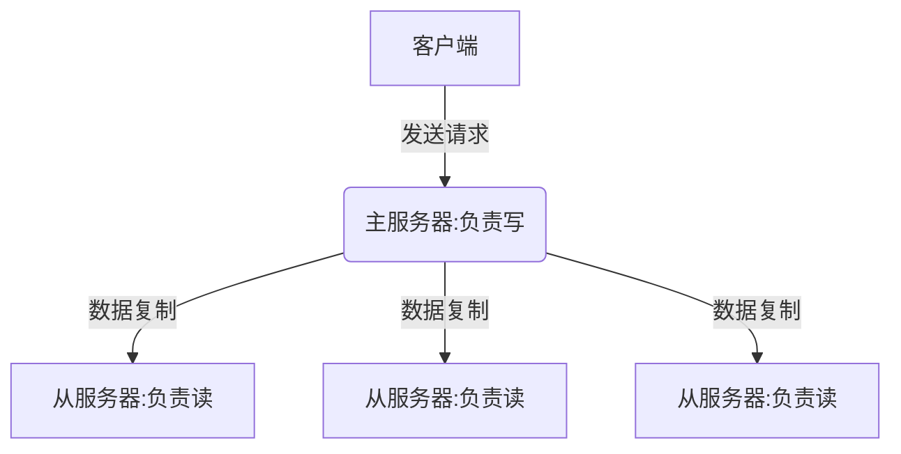
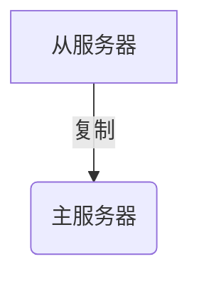

### 一、主从架构
#### 1.1 为什么要主从
* Redis的内存是有限的。
* 单台Redis支持的并发量也是有限的。
* 实现高可用性

>Redis作者Salvatore Sanfilippo已将Master/Slave架构改名为Master/Replica

#### 1.2 主从特点
* 主服务器负责接收写请求
* 从服务器负责接收读请求
* 从服务器的数据由主服务器复制过去。主从服务器的数据是一致的

优点很明显
> 读写分离(主服务器负责写，从服务器负责读)
高可用(某一台从服务器挂了，其他从服务器还能继续接收请求，不影响服务)
处理更多的并发量(每台从服务器都可以接收读请求，读QPS就上去了)

#### 二 复制功能
>主从服务器必须保证数据的`一致`

>在Redis中，用户可以通过执行`SALVEOF`命令或者设置salveof选项，让一个服务器去复制(replicate)另一个服务器，我们称呼被复制的服务器为主服务器(master)，而对主服务器进行复制的服务器则被称为从服务器(salve)

#### 2.1 如何实现主从复制
主从复制分两种情况：
* 初次同步:从服务器没有复制过任何的主服务器，或者从服务器要复制的主服务器跟上次复制的主服务器不一样。
* 短线后的同步:处于命令传播阶段的主从服务器因为网络原因中断了复制，从服务器通过自动重连重新连接主服务器，并继续复制主服务器

在Redis2.8之前这两种情况都是使用同一种方式实现的，如下:
> 同步(sync):将从服务器的数据库状态更新至主服务器的数据库状态
   
> 命令传播(command propagate):主服务器的数据库状态被修改，导致主从服务器的数据库状态不一致，让主从服务器的数据库状态重新回到一致状态。

可以看到，断线后复制这部分其实缺少的只是部分的数据，但是要让主从服务器重新执行SYNC命令，这样的做法是非常低效的。(因为执行SYNC命令是把所有的数据再次同步，而不是只同步丢失的数据)。Redis2.8之后对此进行了改进

#### 2.1.1 复制前的准备
* 从服务器设置主服务器的IP和端口

* 建立与主服务器的Socket连接

* 发送PING命令(检测Socket读写是否正常与主服务器的通信状况)

* 身份验证(看有没有设置对应的验证配置)

* 从服务器给主服务器发送端口的信息，主服务器记录监听的端口

>Redis从2.8版本开始，使用PSYNC命令来替代SYNC命令执行复制时同步的操作。

`PSYNC`命令具有完整重同步和部分重同步两种模式(对应初次复制和断线后复制)。

#### 2.1.2完整重同步
** 实现:**

* 从服务器向主服务器发送PSYNC命令
* 收到PSYNC命令的主服务器执行BGSAVE命令，在后台生成一个RDB文件。并用一个缓冲区来记录从现在开始执行的所有写命令。
* 当主服务器的BGSAVE命令执行完后，将生成的RDB文件发送给从服务器，从服务器接收和载入RBD文件。将自己的数据库状态更新至与主服务器执行BGSAVE命令时的状态。
* 主服务器将所有缓冲区的写命令发送给从服务器，从服务器执行这些写命令，达到数据最终一致性。

#### 2.1.2部分重同步
部分冲同步只需要同步缺失的数据就可以了。

* 主从服务器的复制偏移量
>`复制偏移量`：执行复制的双方都会分别维护一个复制偏移量
**主服务器每次传播N个字节，就将自己的复制偏移量加上N
**从服务器每次收到主服务器的N个字节，就将自己的复制偏移量加上N

通过对比主从复制的偏移量，就很容易知道主从服务器的数据是否处于一致性的状态！
    
* 主服务器的复制积压缓冲区
>当主服务器进行命令传播时，不仅仅会将写命令发送给所有的从服务器，还会将写命令入队到`复制积压缓冲区`里面(这个大小可以调的)。如果复制积压缓冲区存在丢失的偏移量的数据，那就执行部分重同步，否则执行完整重同步。

* 服务器运行的ID(run ID)
>`服务器运行的ID`(run ID)实际上就是用来比对ID是否相同。如果不相同，则说明从服务器断线之前复制的主服务器和当前连接的主服务器是两台服务器，这就会进行完整重同步。

大概流程如下：

#### 2.1.3命令传播
>当完成了同步之后，主从服务器就会进入命令传播阶段。这时主服务器只要将自己的写命令发送给从服务器，而从服务器接收并执行主服务器发送过来的写命令，就可以保证主从服务器一直保持数据一致了！

在命令传播阶段，从服务器默认会以每秒一次的频率，向服务器发送命令REPLCONF ACK <replication_offset> 其中replication_offset是从服务器当前的复制偏移量
发送这个命令的作用：
* 检测主从服务器的网络状态
* 辅助实现min-slaves选项
* 检测命令丢失

